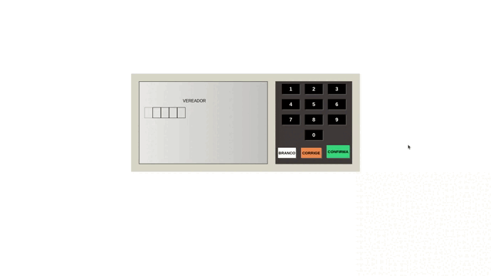

<h1 align="center">
  

      
  

  <h2>URNA ELETRONICA</h2> 
  
Esta aplicaçao foi desenvolvida durante a live "3 Projetos p/ Portfólio em Javascript para Iniciantes" do tutor: Bonieky Lacerda

  
</h1>

## TECNOLOGIAS
- ⚛️ [HTML5](https://developer.mozilla.org/pt-BR/docs/Web/HTML)
- ⚛️ [CSS3](https://developer.mozilla.org/pt-BR/docs/Web/CSS)
- 💹 [JAVASCRIPT](https://developer.mozilla.org/pt-BR/docs/Web/JavaScript)

## Testes
[TESTE AQUI](https://edimilsonbraz.github.io/urna-javascript/)

DEPUTADOS VÁLIDOS
 
NUMERO: 92000</sapn> 
NUMERO: 93000</sapn> 
 

GOVERNADORES VÁLIDOS
 
NUMERO: 92</sapn> 
NUMERO: 93</sapn> 
 

PRESIDENTES VÁLIDOS
 
NUMERO: 38</sapn> 
NUMERO: 40</sapn> 
 

## License
[**Edimilson Braz**](https://www.linkedin.com/in/edimilsonbraz/)

  

